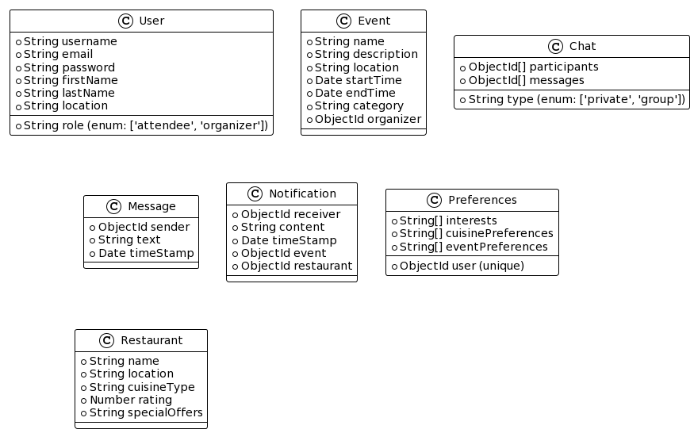
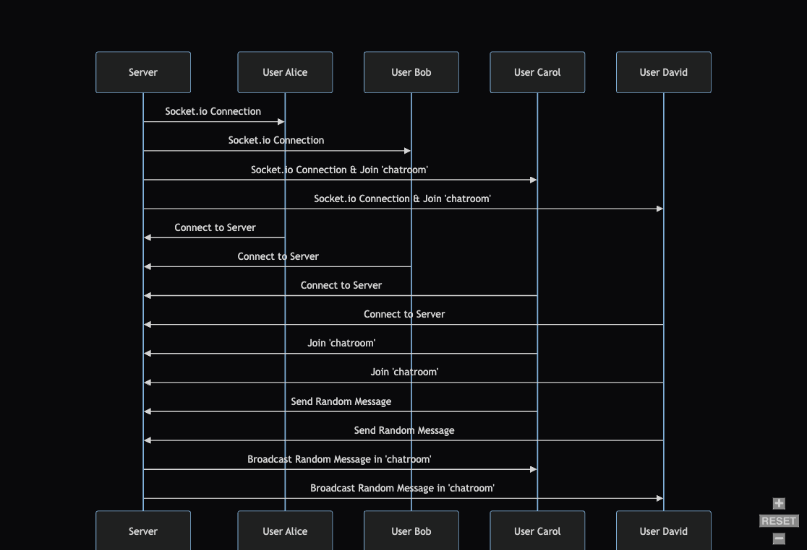

# Midterm Project

## Project: Spots, backend.

## Author: Bryan O. Garduno Gonzalez

## Problem Domain

Spots, a backend application designed for both travel enthusiasts and locals, focuses on enriching the experience of exploring new places. The goal is to offer personalized recommendations for local events, restaurants, and tourists experiences. Built with Express, MongoDB, and socket.io, Spots aims to simplify the discovery of local attractions and activities, addressing the common challenge of quickly finding enjoyable and relevant experiences in a new area or even familiar surroundings.

## Links and Resources

- [GitHub Actions ci/cd](https://github.com/Spots-LLC/spots-backend/actions)
- [Main Branch Deployment](https://spots-backend.onrender.com)
- [Project Management](https://github.com/orgs/Spots-LLC/projects/1/views/1)
- [Progress Reflections](https://github.com/brosmar18/reading-notes/blob/main/code-401/midterm/reflections.md)

## Collaborators

- **ChatGPT by OpenAI**: Used as a programming partner for brainstorming ideas, debugging code, formulating tests, and drafting documentation.

## Setup

### `.env` requirements (where applicable)

A .env file is included in local repository. A .env-sample file is uploaded to the remote repo so collaborators understand what environmental variables are being used.

### How to initialize/run your application (where applicable)

- e.g. `npm start`

### How to use your library (where applicable)

## Features

### Backend Framework

- **Express Server**: Utilizes Express.js for creating a scalable and efficient server for handling API requests.
- **HTTP & WebSocket Server**: Integrates HTTP and WebSocket servers, enabling both RESTful API and real-time communication capabilities.

### Database Design and Management

- **MongoDB Integration**: Exploys MongoDB, a NoSQL database, for storing and managing application data, using Mongoose for object data modeling.
- **Comprehensive Data Models**: Includes models for `User`, `Event`, `Preferences`, `Restaurant`, `Notification`, `Chat`, and `Message`, covering all essential aspects of the application.

## Authentication and Security

- **User Authentication**: Implements secure user authentication with bcrypt for password hashing and JWT for token generation and verification.
- **Middleware for Security**: Employs `verifyToken` middleware for route protection, ensuring access control based on user authentication.

### Real-Time Communication

- **Socket.io Integration**: Implements real-time chat functionality using Socket.io, allowing for live user interactions.
- **Dynamic User Interaction**: Manages user connections, broadcasing user status (online/offline), and message exchange in chatrooms.

### CRUD Operations and API Routes

- **Generaic CRUD Operations**: Utilizes a `Collection` class for standardizing CRUD operations across different data models.
- **Modular API Routing**: Organizes API endpoints into modular routes for authentication, user management, events, preferences, restaurants, and more.

### Error Handling and Logging

- **Custom Error Handlers**: Includes custom handlers for 404 (Not found) and 500 (Server Error), enhancing error reporting and debugging.
- **Comprehensive Logging**: Implements a custom logging system using Winston, providing detailed logs in both development and production environments.

### Interactive API Endpoints

- **User Management**: Supports operations like user registration, login, fetching suer data, updating, and deletion.
- **Event Management**: Allows creating, fetching, updating, and deleting events, with user authentication for secure access.
- **User Preferences**: Manages user preferences, enabling personalized experiences for events and restaurants.
- **Restaurant Recommendations**: Offers CRUD functionalities for restaurants, contributing to the application's recommendation feature.
- **Chat Functionality**: Provides endpoints for real-time chat operations, enhancing user engagement.

### Scalability and Maintainability

- **Environment Variable Management**: Usees `dotenv` for handling environmental variables, promoting scalability and security.
- **Code Organization**: Focus on a well-organized code structure, to enhance readability and maintainability.

## Tests

Testing in the Spots, backend project is comprehensive, covering various aspects of the server, routse, and error handling.

### Running the Tests:

To run the tests for the Spots, backend project, use the command:

`npm test`

This command will execute all test suites, providing coverage for server behavior, API endpoints, and error handling.

### Tests Overview

- **Server Tests(`server.test.js`)**:
  - Verifies the home route and error route responses.
  - Tests MongoDB connection and server start-up logging.
- **User Registration Tests (`register.test.js`)**:

  - Ensures successful user registration and handling of registration with existing email.
  - Handles errors during the registration process.

- **User Login Tests (`login.test.js`)**:

  - Tests successful user login and failure scenarios, including non-existent user and incorrect password.
  - Manages errors during the login process.

- **404 Error Handler Tests(`404.test.js`)**:
  - Confirms taht the server returns a 404 status code and appropriate message for non-existent routes.
- **500 Error Handler Tests(`500.test.js`)**:
  - Validates the handling of internal server errors, ensuring a 500 status code and error message are returned.

### Incomplete or Skipped Tests:

In the current phase of development, certain components of the aplication have not yet been covered by testing. These include route functionalities (Event, Preferences, Restaurant, and User Management), the Socket.io integration for real-time communcation, and the Collection class that handles CRUD operations. The abscence of tests for these components is due to time constraints in the initial development cycle.

I acknowledge the critical importance of comprehensive testing in software development and assure that the test coverage for these components would be of high priority in the future.

## Diagrams

### Database Models

### Socket.io Flow

## Resources

Here are some helpful resources and documentation that were used in the development of this project:

- [MongoDB Quick Start Guide for Node.js](https://www.mongodb.com/docs/drivers/node/current/quick-start/)
- [winston Documentation](https://www.npmjs.com/package/winston)
- [winston-daily-rotate-file Documentation](https://www.npmjs.com/package/winston-daily-rotate-file)
- [Express Routing Guide](https://expressjs.com/en/guide/routing.html)
- [Official Socket.io Documentation](https://socket.io/get-started/chat)
- [Socket.io Private Messaging Example](https://socket.io/get-started/private-messaging-part-1/?fbclid=IwAR0zZ67vaXLTrCzU2hNS4_OsBEm_350-IF6XjnIi3qjEPgjTI6VQLiZTJHc)
- [MongoMemoryServer Documentation](https://github.com/nodkz/mongodb-memory-server)
